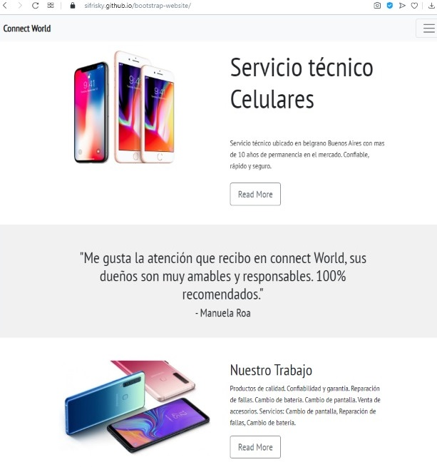

# Bootstrap-Website
Deployment: [bootstrap-website](https://sifrisky.github.io/bootstrap-website/)

_Mi primera landing page_

# Preview 🚀


# Code
* src, is the source code of the website
* docs, have images, and text about this website


*********************************************************************
<!--My fonts-->
Fuentes utilizadas: 
Documentación Fonts: https://fonts.google.com
<!--Bootstrap-->
Documentación Bootstrap: https://getbootstrap.com/docs/4.5/components/navbar/#text

# Escogiendo mi navegacion 
<!--NAVIGATION-->
* Se escogió para el navbar el estilo NAV de bootstrap ya que este se ve bien en otros dispositivos.

* Mover mi navegación: Para cambiarla hacia la derecha le agregamos una clase llamada margin (margen) en el nav "ml-auto" en las ul que contiene las li. 
```<ul> <li>
Ejemplo: <ul class="navbar-nav ml-auto">
```
* Eliminamos la etiqueta span de home. 
```
<span>
```
* Reemplazamos Feature por about.
* Centramos el contenido y espaciamos hacia los lados con un contenedor de clase div container.

# Realizando una nueva navegación en la seccion HEADER.

Esto es para que el usuario navegue en distintas secciones.
* Dividir el contenido a la mitad: Agregamos un contenedor de bootstrap en 2 partes (dos columnas de bootstrap).
* Imagen: Para que se vea completa, colocamos un style de 100% y una clase de margen top de el tamaño que prefieras (en mi caso fue un mt-5). En mi ejemplo utilice un  div de Clase container.  
```
<div class="container mt-5">
```
Nota: No te olvides que al llamar la imagen se hace con el mismo nombre de guardado. 

* El texto. Dentro de las columnas coloque unos div de clase header para el contenido de la izquierda. 
* Titulo (h1) para acercar la imagen al titulo usamos la clase display-4, un parrafo (p) y button (btn-lg) para alargar los botones del tamaño del recuadro.
```
Titulo     <h1> 
Acercar titulo a la img <h1 class="display-4"> -->
Parrafo     <p> 
Button     <a hrf="# class="btn btn-outline-secundary btn-lg">
```

# Seccion de testimonios

* Agregar un usuario y un ID.
* Estilizando el tamaño del autor con etiquetas h3 para el autor y h2 para el parrafo.
* Mejoramos con css.
* Para evitar que se vea encimado usamos una clase.
 
```
<p class="mb-2">
```

# Seccion de informacion.

## Section INFO ONE.
_Separar contendido: De derecha a izquierda creando filas y columnas. (2 columnas de 6 que conforman las 12 de bootstrap).
Nota: Las filas solo funcionan dentro de una fila de bootstrap por ellos agregamos las columnas en mi div container. Para centrar la imagen en la seccion coloco un margen en el eje "y" columnas._
<!--<div class="col-md-6 my-auto">-->

## Section INFO TWO.
_Visualizar la pagina de navegaciones en todas las secciones: Repetimos lo anterior pero notamos que al bajar la barra de navegación no se muestra más. Para hacer que siempre se vea necesitaremos agregar la clase de bootstrap un fixed-top._
```
Ejemplo:
<nav class="navbar navbar-expand-lg navbar-light bg-light fixed-top">
```
* Mejoras en el Header: Para evitar que la navigation se vea encimado agregamos px en nuestro archivo de css. Le cambiamos los px para el espaciado inclusive si usas medias querys podrias hacerle un mejor trabajo. Veáse archivo.
```
header {
      75 px
} 
```
* Agregando color a nuestra sección: Añadido directamente en la section un style background. 
```
<section id="info-two" style="background: #f1f1f1;">
```
* Formulario: Es una tarjeta que aparece como un cuadro blanco que bootstrap crea. Hacemos una columna de 5 (para luego hacer un espaciado).  Esto realizamos para name and email.
* 
```
<form class="card">      //Aqui adentro tendra una trajeta body.
<div class="card-body">  //Dentro del body estaaran los inputs tipo text.
```

* placeholder: para ello hago un input con placeholder de tipo texto con lo que debe cargarse adentro. 
```
 <div class="form-group">
      <input type="text" class="form-control" placeholder="Name">
</div>
```

* Textarea para la parte del mensaje y el boton cusamos btn-block , lo que hace este boton es colocarlo del tamaño de mi recuadro. 
```
<textarea> 
<button class="btn btn-outline-secondary btn-block">
```

# Footer: 
Para el footer o seccion final. Buscamos Linkear con la navegación y le añadimos un background en nuestro archivo css con la imagen que queremos mostrar.

# Animaciones:
Esta la realizamosd en la seccion de script. (tambien podrias hacerlo en un archivo de .js por separado).

Adicionalmente el scroll lo guardamos en una variable de windows y lo realizamos para cada seccion que se desee animar: 
```
window.sr = ScrollReveal(); 
```

Esto es solo un metodo que luego vamos a configurarlo. Lo que hace el metodo es seleccionar un elemento y realizar una navegacion (ver seccion de <script>)

veamos el siguiente ejemplo con navbar:

```
sr.reveal('.navbar', {
  duration: 2000,
  origin: 'bottom'
});
```

Por ultimo, para no cambiar el contenido de forma brusca utilizaremos crolling-StackOverflow:
Documentación: https://stackoverflow.com/questions/7

Con esta Jquery observamos como se desliza entre distintas secciones.

-Fin-

Made with a lots of 💖 
